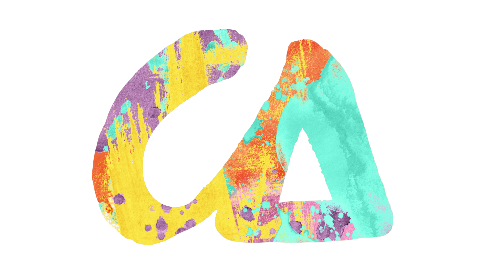
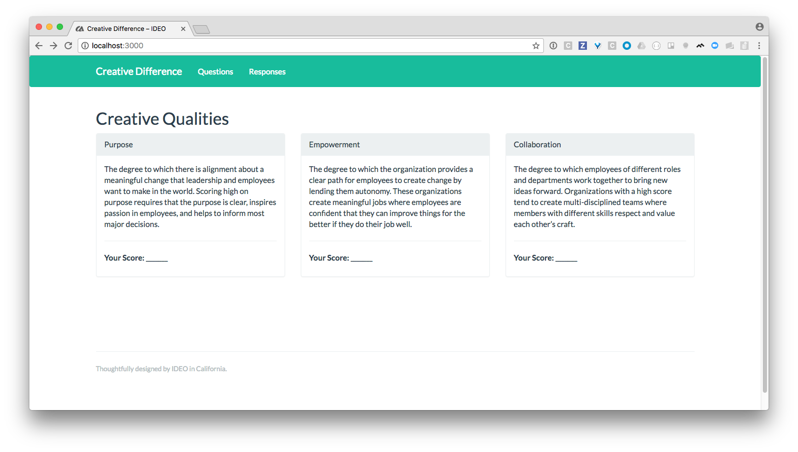
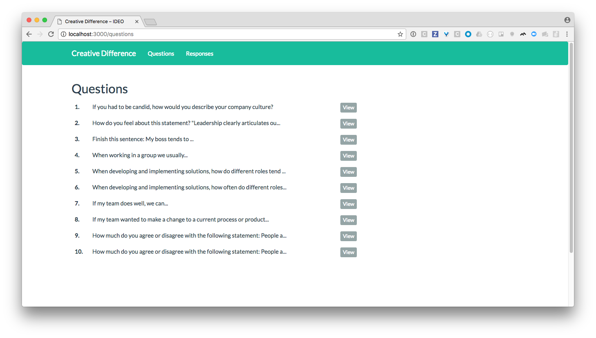
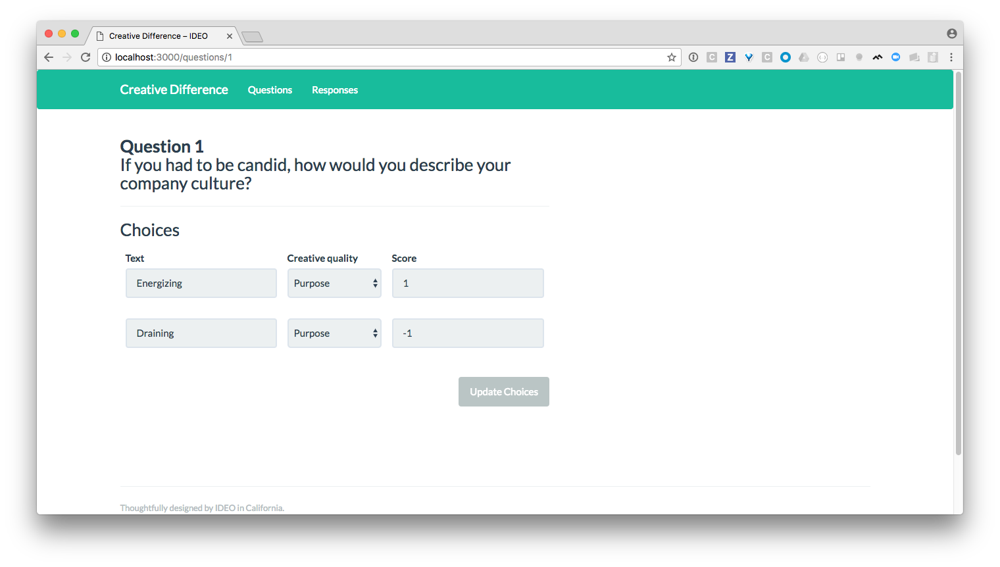
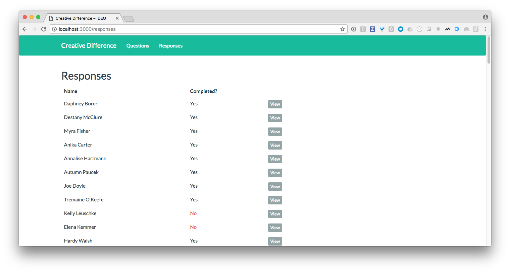
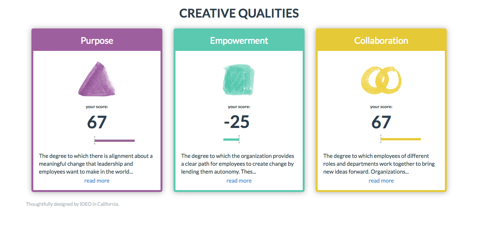
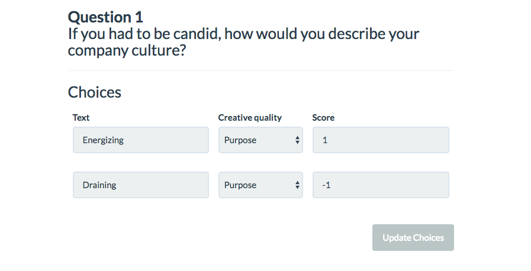
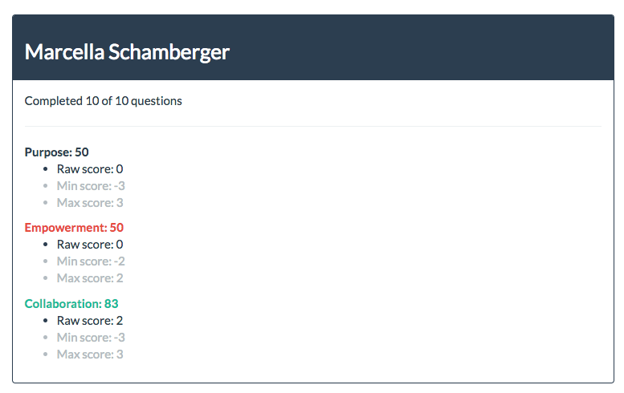
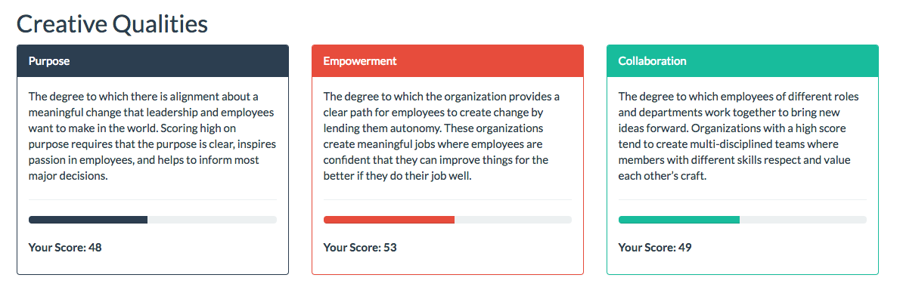

# IDEO Creative Difference Rails Challenge

Hello! Welcome to the [IDEO Creative Difference](https://creativedifference.ideo.com) Rails challenge.

This challenge will test your ability to write clean, intuitive, and well-tested Ruby, HTML, CSS and Javascript – all things we care about deeply at IDEO!

## Choose which part to do

Please choose one of the two parts that can show off your strongest skillset(s):

**Part 1: Rails - build new back-end features and tests (~ 1 hour)**

**Part 2: React + CSS - build new React components and style them (~ 1 hour)**

First, you'll need to set up the Rails environment, detailed below in [Environment Setup](#environment-setup).

Then, once you're done with the part you have chosen, please [head down to the reflection and submission in Part 3](#part-3-reflection-and-submission).

Good luck!

## Introduction

This challenge contains an example Rails app with some pre-existing code and tests.

Your task will be to take the app in this repo and add new behavior to it!

## Environment Setup

Start by cloning this repository:

```bash
$ git clone git@github.com:ideo/c-delta-challenge.git
```

Next, install the project's dependencies using Bundler (run `gem install bundler` if you don't have it). You'll need Ruby and Yarn installed before setting up the project's dependencies.

```bash
$ cd c-delta-challenge
$ bundle install
$ yarn install
```

Confirm that Rails works!

```bash
$ rails --version
Rails 5.1.6
```

Now set up your database:

```bash
$ rails db:migrate
$ rails db:seed
$ rails db:test:prepare
```

We've included a test suite written using [RSpec](http://rspec.info/). Run it and ensure that all tests pass!

```bash
$ rspec spec/

...


Finished in 0.43062 seconds (files took 1.29 seconds to load)
22 examples, 0 failures
```

Finally, run the Rails server and load the page at `http://localhost:3000`

```bash
$ rails s
=> Booting Puma
=> Rails 5.0.7 application starting in development on http://localhost:3000

...
```

​:tada: :clap: :tada:

You're ready to start!

## A Quick Walkthrough

Our demo app is a (very!) pared down version of our [Creative Difference](http://creativedifference.ideo.com) product, which helps organizations assess the different qualities that help make companies innovative. We achieve this by surveying hundreds (or thousands) of employees across the organization and scoring their responses based on a rubric.

Based on the survey responses, the company gets a score for each Creative Quality which we help them measure and take action to improve.

If you run the Rails server, the home page shows a very basic dashboard with three creative qualities: **Purpose**, **Empowerment**, and **Collaboration**.



If you head over to the **Questions** tab, you can see the questions that make up this sample survey.



Drilling down into a question lets you see the different answer choices and how each choice impacts the score of the Creative Quality it corresponds to:



In this example, an answer of "Energizing" gives a 1 score for the **Purpose** creative quality. We have simplified the implementation in this app, but in our production app, many questions have choices that impact more than one quality.

Our seeds file creates 100 survey responses -- click the **Responses** tab to see all of them.



A response is "completed" if all of the 10 questions have been answered.

Drilling down into a response lets you see how the respondent answered each question (their answer is in **bold**):


That's the tour! Let's start the challenge.

# The Challenge

The challenge will take you through a few steps that include scoring survey responses, styling and creating a dashboard of final results that will look like this:



**_If you're skipping to Part 2, please [head on down there](#part-2-displaying-the-results)._**

## Part 1: Scoring Responses

When viewing a question, you'll notice that each choice affects a particular Creative Quality either positively or negatively.



This means that if a respondent chooses "Draining," the score for "Purpose" is decreased by 1.

### 1.1: Scoring Creative Qualities for a single response to a question

Update the `response#show` page to show how each question response impacts Creative Quality scores, as follows:


If a score is impacted positively, color it in green. If it's impacted negatively, color it red (you can use [Bootstrap](http://getbootstrap.com/docs/3.3/) for this).

When you're done, write a commit. If your code changes the behavior of any models, make sure that behavior is tested!

### 1.2: Scoring Creative Qualities for an entire response

Next, we're diving into some complexity. Let's display the Creative Quality score for the entire response at the top of the page:



We score each Creative Quality by adding up the raw score for all of the responses where someone chose a choice associated with that creative quality, and divide that by the maximum possible positive score for that quality.

In more detail:

- The **raw score** is the sum of all of the question response scores for that creative quality.
  - **Example:** If I select four question choices that impact the **Purpose** quality with the scores 3, 3, 2, and -1, then my raw score for Purpose would be `3 + 3 + 2 - 1 = 7`.
- The **max score** is the highest possible score a respondent could've gotten for a quality _(ie: if you answered by choosing the highest value choice for each question that is linked to that quality)_. It is dynamic, because if you skip a question, we don't increase the max.
  - **Example:** If you answered 6 questions with choices that are linked to **Purpose**, then the maximum score would be the sum of all the highest scoring choices linked to Purpose for those questions. For example, if the maximum scores were: 2, 1, 4, 3, 2, 3, then the max would be `2 + 1 + 4 + 3 + 2 + 3 = 15`

Please update the response page to show the raw and max for each quality.

Write another commit when you're done (and yep –– test any behavior changes to models!).

### 1.3 Scoring Creative Qualities globally

At this point you've completed scoring for individual question responses as well as for entire response sets.

Now let's compute the final scores across all responses so that we can display them on the front page, like this:



The **normalized score** (ie: **Collaboration: 73**) is the final score that we display per quality, and should be between -100 and 100.

- The formula is: `(total_raw_for_quality / total_max_for_quality) * 100`
- Step 1: Add up the raw and max scores for this quality across all responses.
- Step 2: Divide the raw by the max and multiply it by 100 (_we also floor the value if > 100 or ceil if < -100_).
- **Example:** If across all responses, the total raw score for Collaboration is 240 and the max is 575, then the normalized score would be `(240 / 575) * 100 = 42`). Round to the nearest integer, and ceil or floor the value if it ends up outside the -100 to 100 bounds.

Your tasks:

- Compute the normalized score for each Creative Quality.
- Display each Creative Quality's normalized score on the index page.

## Part 2: Displaying the Results

The home page lists three of the six Creative Qualities we see as essential to innovation within an organization. In this part, we're going to restyle the results, and then rewrite the view of the page to use React (v16) instead of Rails + ERB.

**_If you have skipped Part 1, please uncomment the mock JSON at the top of `app/views/creative_qualities/index.html.erb`._**

**_If you're skipping Part 2, please [head on down to the reflection](#part-3-reflection-and-submission)._**

### Part 2.1: Using React to display and sort the Creative Qualities

In order to make the application more dynamic and interactive, we'd like to start using React (v16) to power the index page.

The site is already setup to use the [webpacker](https://github.com/rails/webpacker) gem and [React](https://5abc31d8be40f1556f06c4be--reactjs.netlify.com/docs/hello-world.html), and you'll find a basic `App.js` React component already provided for you in the `/app/javascript/components` directory.

You'll also see in `index.html.erb` that the Qualities are being output in JSON like so, which you can access from React to render the appropriate data:

```javascript
window.qualsJSON = [... qualities ...]
```

Please replace the ERB code (e.g. `<%= @creative_qualities.find_each...`) with the React app being rendered in `<div id="react-root" />`, creating React components to render the creative qualities instead.

Your tasks:

- Replace the Rails + ERB code in `index.html.erb` by implementing the provided React `App.js` and writing the appropriate React JS and JSX code.
- Implement the "read more" link on each description, so that the text is truncated to 120 characters. Clicking "read more" should display the whole description and toggle into a "read less" link.
- Add two sorting buttons at the top right-hand corner of the page:
  - **Sort by score** should sort the Creative Quality cards by score.
  - **Sort by name** should sort the Creative Quality cards alphabetically by the name.
  - Clicking a button multiple times should toggle the sorting, e.g. low to high score, and then high to low score.

### Part 2.2: Re-styling the Creative Quality results

Using the below screenshot as your guide, re-style the Creative Quality index page to look as similar to the mockup as possible.


You'll create a progress bar that corresponds to the final (normalized) score of each quality. Note that scores range from -100 to 100, so the middle point of the bar (i.e. an "empty" bar) should represent a score of 0, negative scores should extend to the left, and positive scores should extend to the right, as shown above.

Resources:

- Colors are already stored on each `CreativeQuality` object in the `color` field
- Image assets for each quality are in this folder: `/app/assets/images/qualityIcons`

:star: You're all done! Make a final commit of your work! :star:

\* Bonus points if you can add any JS tests for code coverage :trophy:

## Part 3: Reflection and Submission

That's a wrap!

To submit your challenge, please **send us an email at c-delta-challenge@ideo.com** with the following:

### Reflection

Tell us what you thought of this coding challenge. What did you like? What did you not like?

### Code Improvements

If you had more time, are there any pieces of code (ours or yours) that you'd improve? How so and why?

### A link to your code!

Create a Github repo (or a downloadable location e.g. dropbox) and send us the link!

**Please do not fork this repo, as it will be publicly viewable for all other candidates.**

## Thanks!

Hope you enjoyed this challenge – we really appreciate you making the time!

– The IDEO Products Team
