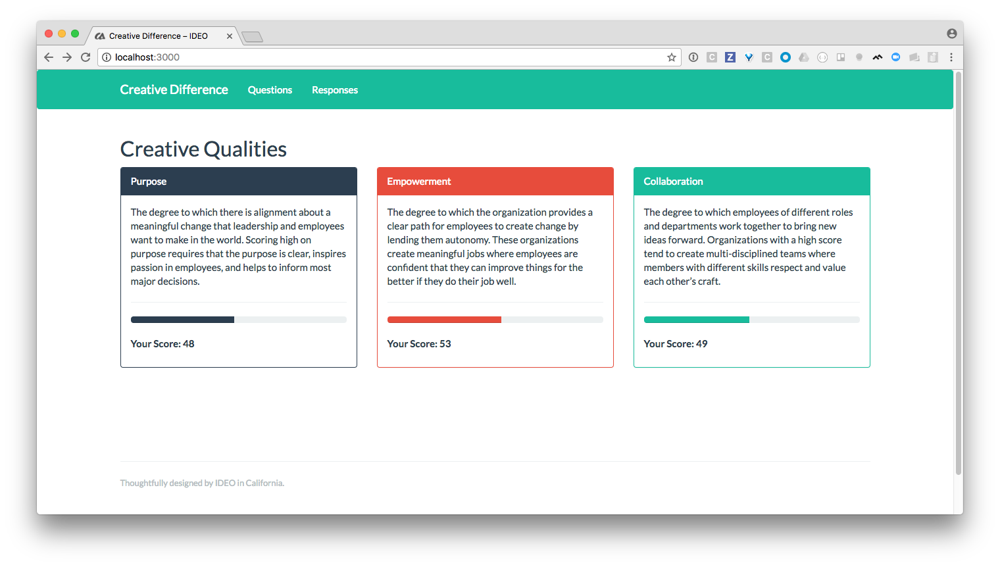
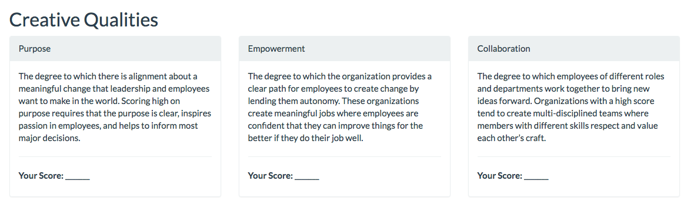
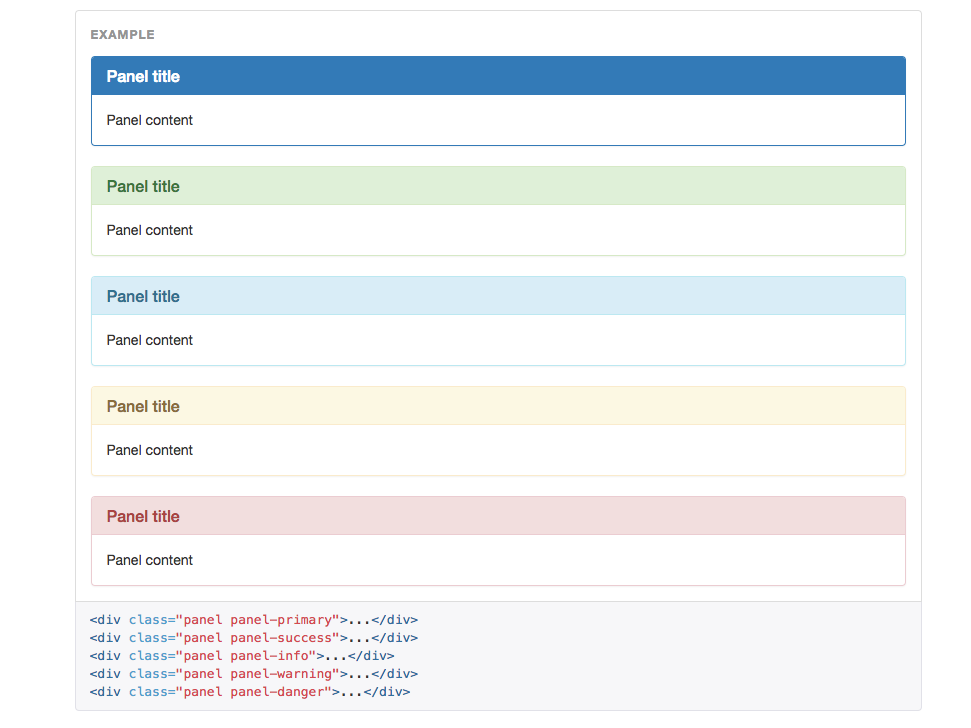

# IDEO Creative Difference Rails Challenge

Hello! Welcome to the [IDEO Creative Difference](https://creativedifference.ideo.com) Rails challenge.

This challenge will test your ability to write clean, intuitive, and well-tested Rails code – all things we care about deeply at IDEO!

Please set aside **two hours** to complete this exercise. If you have any questions or get stuck on something (including setup), don't hesitate to send an email to c-delta-challenge@ideo.com. Good luck!

## Introduction

This challenge contains an example Rails app with some pre-existing code and tests.



Your task will be to take the app in this repo and add new behavior to it! ([Jump to the challenge](#the-challenge))


## Environment Setup

Start by cloning this repository:

```bash
$ git clone git@github.com:ideo/c-delta-challenge.git
```

Next, install the project's dependencies using Bundler (run `gem install bundler` if you don't have it)

```bash
$ cd c-delta-challenge
$ bundle install
```

Confirm that Rails works!

```bash
$ rails --version
Rails 5.0.1
```

Now set up your database:

```bash
$ rails db:migrate
$ rails db:seed
$ rails db:test:prepare
```

We've included a test suite written using [RSpec](http://rspec.info/). Run it and ensure that all tests pass!

```bash
$ rspec spec/

...


Finished in 0.43062 seconds (files took 1.29 seconds to load)
22 examples, 0 failures
```

Finally, run the Rails server and load the page at `http://localhost:3000`

```bash
$ rails s
=> Booting Puma
=> Rails 5.0.1 application starting in development on http://localhost:3000

...
```

​:tada: :clap: :tada:

You're ready to start!


## A Quick Walkthrough

Our demo app is a (very!) pared down version of our [Creative Difference](http://creativedifference.ideo.com) product, which helps organizations assess the different qualities that help make companies creatively competitive. We achieve this by surveying hundreds (or thousands) of employees across the organization and scoring their different creative qualities based on a rubric.

Based on the survey responses, the company gets a score for each Creative Quality which we help them analyze and improve on.

If you run the server, the home page should list three creative qualities: **Purpose**, **Empowerment**, and **Collaboration**.


Our list of survey questions is configurable – clicking on **Questions** tab lets you see the different questions that make up the survey.


Drilling down into a question lets you see the different answer choices and how each choice impacts the score of the Creative Quality it corresponds to:


(In this example, an answer of "Strongly Disagree" gives a -3 score for the **Purpose** creative quality)

Our seeds file also creates 100 random survey responses. Click the **Responses** tab to see all of them.


A response is "completed" if all of the 10 questions have been answered.

Drilling down into a response lets you see how the respondent answered each question (their answer is in **bold**):


That's the tour! Let's start the challenge.

# The Challenge

## Part 1: Creative Quality Colors

The home page lists three of the six Creative Qualities we see as essential to innovation within an organization.



In order to make each Creative Quality more memorable, we'd like to assocate each quality to a color. We're already using [Twitter Bootstrap](http://getbootstrap.com/) and the [Flatly Bootswatch Theme](https://bootswatch.com/flatly/), so let's have the colors correlate to one of the five colors listed in the **Container > Panels** section (`primary`, `danger`, `success`, `info`, and `warning`)



Your job will be to implement the following:

- Assign each Creative Quality to one of the five Bootstrap colors.
- Whenever a new Creative Quality is created, it should automatically be assigned a color at random.
- Make it so that no two Creative Qualities can be assigned to the same color (let's assume for now that we won't have more than five qualities)
- The panels on the home page should make use of the colors (**see screenshot below**; refer to the [Bootswatch documentation](https://bootswatch.com/flatly/))


When you're done, write a commit. If your code changes the behavior of any models, make sure that behavior is tested!

## Part 2: Scoring Responses

When viewing a question, you'll notice that each choice affects a particular Creative Quality either positively or negatively.


This means that if a respondant chooses "Strongly Disagree," the score for "Purpose" is decreased by 3.

### 2.1: Scoring Creative Qualities for a single response to a question

Update the `response#show` page to show how each question response impacts Creative Quality scores, as follows:


If a score is impacted positively, color it in green. If it's impacted negatively, color it red (you can use Bootstrap for this).

When you're done, write another commit (and write tests if you changed any models!).

### 2.2: Scoring Creative Qualities for a response set

Next, let's display the Creative Quality score for the entire response and display it at the top of the page:


We score each Creative Quality as follows:

- The **min score** is the lowest possible score the respondent could've gotten (ie, if the respondent answered the most negative choice for each question)
- The **max score** is the highest possible score the respondent could've gotten (ie, if the respondent answered the most positive choice for each question)
- The **raw score** is the sum of all of the scores chosen for that creative quality.
  - **Example:** If I answered four questions that impacted the **Purpose** quality 3, 3, 2, and -1, my raw score would be  `3 + 3 + 2 - 1 = 7`.)
- The **normalized score** (ie: **Collaboration: 73**) should be between 0 of 100. It takes the raw score and normalizes it on a scale of 100 based on the min and max scores as follows: (`(abs(min_score) + raw_score) / (abs(min_score) + max_score) * 100` )
  - **Example:** If my min score was -14, my max score was 12, and my raw score was 5, then my normalized score would be `((14 + 5) / (14 + 12)) * 100 = 73 `). Round the normalized score to the nearest integer.
- If a respondee didn't answer any questions (in this example only 9 of 10 were answered), don't factor in the skipped question(s) into the min and max scores.


Write another commit when you're done (and yep –– test any behavior changes to models!).

### 2.3 Scoring Creative Qualities globally

At this point you've completed scoring for individual question responses as well as for entire response sets.

Now let's show our global scores on the front page!


Global scoring is simple:

- For each Creative Quality, show the average response score rounded to the nearest integer.

- Above each score, add a little "progress bar" to visualize the score (there's an existing [Bootswatch component](https://bootswatch.com/flatly/) for doing this). Fill the progress bar with that Creative Quality's color.

You're all done! Make a final commit of your work!


## Part 3: Reflection and Submission

That's a wrap!

To submit your challenge, please **send us an email at c-delta-challenge@ideo.com** with the following:

### Reflection

Tell us what you thought of this coding challenge. What did you like? What did you not like?

### Code Improvements

If you had more time, are there any pieces of code (ours or yours) that you'd improve? How so and why?

### A link to your code!

Create a Github repo and send us the link!

**Please do not fork this repo, as it will be publicly viewable for all other candidates.**


## Thanks!

Hope you enjoyed this challenge – we really appreciate you making the time!

– The IDEO Creative Difference team
